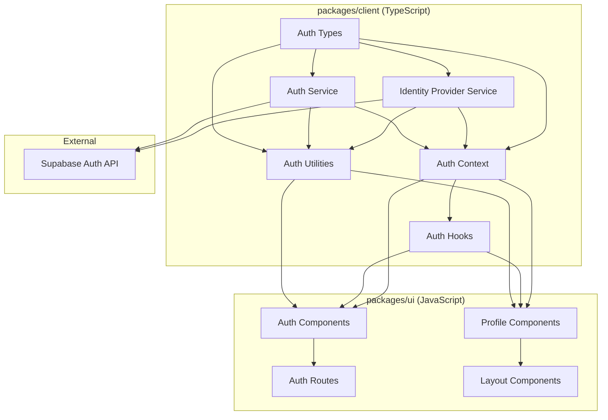
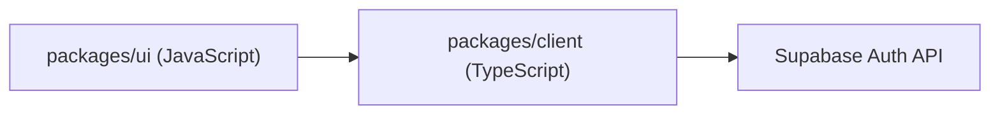

# Supabase Auth Architecture

This document describes the architectural design of the Supabase Auth integration after the recent refactoring. It explains the separation of concerns between packages, the one-way dependency relationship, and provides guidance for developers on how to use the new architecture.

## Table of Contents

1. [Introduction](#introduction)
2. [Architectural Overview](#architectural-overview)
3. [Packages Structure](#packages-structure)
   - [Client Package](#client-package)
   - [UI Package](#ui-package)
4. [One-Way Dependency Relationship](#one-way-dependency-relationship)
5. [Benefits of the Architecture](#benefits-of-the-architecture)
6. [Developer Guide](#developer-guide)
   - [Using TypeScript Interfaces](#using-typescript-interfaces)
   - [Using Auth Services](#using-auth-services)
   - [Using React Hooks and Context](#using-react-hooks-and-context)
7. [Migration Guide](#migration-guide)
8. [Best Practices](#best-practices)

## Introduction

The Supabase Auth integration has been refactored to improve maintainability, type safety, and reusability. The core authentication logic has been separated from the UI components, creating a clean architecture with a one-way dependency relationship.

The refactoring introduces two main packages:

- **`packages/client`**: A specialized TypeScript package that contains all the core Supabase Auth logic, interfaces, and utilities
- **`packages/ui`**: The main React frontend UI package in JavaScript that uses the client package

This separation allows for better code organization, improved type safety, and easier testing and maintenance.

## Architectural Overview

The following diagram illustrates the high-level architecture of the Supabase Auth integration:



The key aspect of this architecture is the **one-way dependency relationship**:

- The UI package depends on the client package
- The client package does not depend on the UI package

This ensures a clean separation of concerns and prevents circular dependencies.

## Packages Structure

### Client Package

The `packages/client` package is a specialized TypeScript package that contains all the core Supabase Auth logic, interfaces, and utilities. It is designed to be framework-agnostic at its core, with React-specific functionality (hooks and context) built on top of the core services.

#### Key Components:

1. **Types (`src/types/auth.ts`)**:
   - Defines TypeScript interfaces for authentication-related data structures
   - Provides type safety for auth operations

2. **Auth Service (`src/services/AuthService.ts`)**:
   - Implements core authentication functionality
   - Manages communication with Supabase Auth API
   - Provides methods for user authentication, registration, and profile management

3. **Identity Provider Service (`src/services/IdentityProviderService.ts`)**:
   - Manages external identity providers (SAML, OIDC, etc.)
   - Handles authentication flows with external providers

4. **Auth Context (`src/contexts/AuthContext.tsx`)**:
   - Provides a React context for authentication state
   - Makes auth state and methods available throughout the application

5. **Auth Hooks (`src/hooks/useAuth.ts`)**:
   - Provides React hooks for accessing auth functionality
   - Simplifies integration with React components

6. **Auth Utilities (`src/utils/auth.ts`)**:
   - Provides utility functions for common auth operations
   - Re-exports functionality for easier imports

### UI Package

The `packages/ui` package is the main React frontend UI package in JavaScript. It contains the user interface components that use the client package for authentication functionality.

#### Key Components:

1. **Auth Components (`src/views/auth/`)**:
   - Login component
   - Signup component
   - Password reset component
   - Account management component

2. **Auth Routes (`src/routes/AuthRoutes.jsx`)**:
   - Defines routes for authentication-related pages
   - Implements route guards for authenticated and unauthenticated users

3. **Profile Components (`src/layout/MainLayout/Header/ProfileSection/`)**:
   - User profile display and management
   - Uses auth state from the client package

## One-Way Dependency Relationship

The architecture enforces a one-way dependency relationship between the packages:



This design was chosen for several important reasons:

1. **Separation of Concerns**:
   - The client package focuses on auth logic and API communication
   - The UI package focuses on user interface and user experience

2. **Maintainability**:
   - Changes to the UI don't affect the core auth logic
   - The client package can be updated independently of the UI

3. **Reusability**:
   - The client package can be used in different UI frameworks or environments
   - The same auth logic can be shared across multiple applications

4. **Testability**:
   - The client package can be tested independently of the UI
   - UI tests can mock the client package

5. **Type Safety**:
   - The TypeScript client package provides strong typing for auth operations
   - This prevents runtime errors in the UI package

## Benefits of the Architecture

The refactored architecture provides several key benefits:

### 1. Type Safety

By implementing the core authentication logic in TypeScript, we gain:

- Compile-time type checking
- Better IDE support with autocompletion and inline documentation
- Early detection of type-related errors
- Clear interface definitions for auth-related data structures

### 2. Reusability

The client package is designed to be reusable:

- It can be used in different UI frameworks (React, Vue, Angular, etc.)
- It can be shared across multiple applications
- It provides a consistent authentication experience across projects

### 3. Maintainability

The separation of concerns improves maintainability:

- Changes to the UI don't affect the core auth logic
- The client package can be updated independently of the UI
- Clear boundaries between packages make the codebase easier to understand
- Smaller, focused modules are easier to test and debug

### 4. Scalability

The architecture supports scaling the application:

- New authentication methods can be added to the client package without affecting the UI
- Additional UI components can be built on top of the client package
- The architecture can accommodate growing complexity in both packages

### 5. Consistency

The centralized auth logic ensures consistency:

- All UI components use the same authentication methods
- Authentication state is managed in one place
- Changes to auth behavior are applied uniformly across the application

## Developer Guide

This section provides guidance for developers on how to use the refactored Supabase Auth integration.

### Using TypeScript Interfaces

The client package provides TypeScript interfaces for auth-related data structures. These interfaces should be used when working with authentication data to ensure type safety.

```typescript
// Import types from the client package
import { 
  UserProfile, 
  SignUpRequest, 
  SignInWithPasswordRequest 
} from '@flowstack/client';

// Use the types in your code
const userProfile: UserProfile = {
  id: 'user-123',
  email: 'user@example.com',
  fullName: 'John Doe'
};

const signUpRequest: SignUpRequest = {
  email: 'user@example.com',
  password: 'password123',
  fullName: 'John Doe'
};
```

### Using Auth Services

The client package provides services for authentication operations. These services should be used for all auth-related functionality.

```typescript
// Import services from the client package
import { authService, identityProviderService } from '@flowstack/client';

// Use the auth service for authentication operations
async function signInUser(email: string, password: string) {
  try {
    const result = await authService.signInWithPassword({ email, password });
    if (result.error) {
      console.error('Sign in error:', result.error);
      return false;
    }
    return true;
  } catch (error) {
    console.error('Unexpected error:', error);
    return false;
  }
}

// Use the identity provider service for external authentication
async function initiateOAuthLogin(providerId: string) {
  try {
    const redirectUrl = await identityProviderService.initiateAuthentication(providerId);
    window.location.href = redirectUrl;
  } catch (error) {
    console.error('OAuth error:', error);
  }
}
```

### Using React Hooks and Context

For React components, the client package provides hooks and context for accessing auth functionality.

```jsx
// Import hooks and context from the client package
import { useAuth, AuthProvider } from '@flowstack/client';

// Use the AuthProvider at the root of your application
function App() {
  return (
    <AuthProvider>
      <Router>
        <Routes>
          <Route path="/login" element={<Login />} />
          <Route path="/dashboard" element={<Dashboard />} />
        </Routes>
      </Router>
    </AuthProvider>
  );
}

// Use the useAuth hook in your components
function Dashboard() {
  const { user, isAuthenticated, signOut } = useAuth();
  
  if (!isAuthenticated) {
    return <Navigate to="/login" />;
  }
  
  return (
    <div>
      <h1>Welcome, {user?.email}</h1>
      <button onClick={signOut}>Sign Out</button>
    </div>
  );
}
```

## Migration Guide

If you're migrating from the previous architecture to the refactored architecture, follow these steps:

1. **Update imports**:
   - Replace direct imports from Supabase with imports from the client package
   - Example: `import { supabase } from '../supabase'` → `import { authService } from '@flowstack/client'`

2. **Use TypeScript interfaces**:
   - Replace any custom interfaces with the ones provided by the client package
   - Example: `interface User { ... }` → `import { UserProfile } from '@flowstack/client'`

3. **Use auth services**:
   - Replace direct Supabase calls with calls to the auth services
   - Example: `supabase.auth.signIn(...)` → `authService.signInWithPassword(...)`

4. **Use React hooks and context**:
   - Replace custom auth hooks with the ones provided by the client package
   - Example: `useCustomAuth()` → `useAuth()`

5. **Update UI components**:
   - Update UI components to use the new auth hooks and services
   - Ensure components handle loading states and errors correctly

## Best Practices

When working with the refactored Supabase Auth integration, follow these best practices:

1. **Always use the client package for auth operations**:
   - Don't bypass the client package and call Supabase directly
   - This ensures consistent behavior and type safety

2. **Use TypeScript interfaces for type safety**:
   - Even in JavaScript files, you can use JSDoc comments with TypeScript interfaces
   - Example: `/** @type {import('@flowstack/client').UserProfile} */`

3. **Handle loading states and errors**:
   - Auth operations are asynchronous and can fail
   - Always handle loading states and errors in UI components

4. **Keep UI components focused on presentation**:
   - UI components should focus on rendering and user interaction
   - Auth logic should be delegated to the client package

5. **Respect the one-way dependency relationship**:
   - Don't import from the UI package in the client package
   - This maintains the clean architecture and prevents circular dependencies