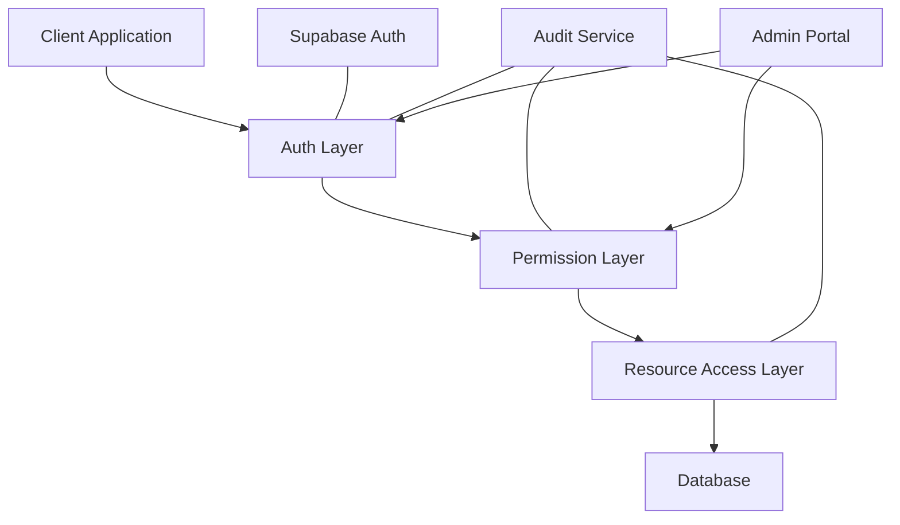

# Enterprise Access Management Design

## 1. Overall Architecture

## 2. Data Model

```mermaid
erDiagram
    User {
        uuid id PK
        string email
        string full_name
        timestamp created_at
        timestamp last_sign_in
        boolean is_active
    }
    
    Organization {
        uuid id PK
        string name
        string slug
        timestamp created_at
        uuid created_by FK
    }
    
    Workspace {
        uuid id PK
        string name
        string slug
        uuid organization_id FK
        timestamp created_at
        uuid created_by FK
    }
    
    OrganizationMember {
        uuid id PK
        uuid organization_id FK
        uuid user_id FK
        string role
        timestamp joined_at
    }
    
    WorkspaceMember {
        uuid id PK
        uuid workspace_id FK
        uuid user_id FK
        string role
        timestamp joined_at
    }
    
    Role {
        uuid id PK
        string name
        string description
        uuid organization_id FK "null for system roles"
    }
    
    Permission {
        uuid id PK
        string resource_type
        string action
        string description
    }
    
    RolePermission {
        uuid id PK
        uuid role_id FK
        uuid permission_id FK
    }
    
    UserRole {
        uuid id PK
        uuid user_id FK
        uuid role_id FK
        uuid workspace_id FK "null for org-level roles"
    }
    
    ResourcePermission {
        uuid id PK
        string resource_type
        uuid resource_id
        uuid user_id FK
        string permission
    }
    
    AuditLog {
        uuid id PK
        timestamp timestamp
        uuid user_id FK
        string action
        string resource_type
        uuid resource_id
        jsonb metadata
        string ip_address
    }
```

## 3. Key Components

### 3.1 Authentication Layer (Supabase Auth)

We'll use Supabase Auth for user authentication, which provides:

- Email/password authentication
- Social logins (Google, GitHub, etc.)
- Magic link authentication
- Multi-factor authentication (MFA)
- JWT tokens for session management
- Password policies and security features

#### 3.1.1 Integration with Existing Authentication

The current system uses two authentication methods that need to be integrated with Supabase Auth:

1. **Basic Auth Integration**:
   - When FASTFLOW_USERNAME and FASTFLOW_PASSWORD environment variables are set, the system uses basic authentication
   - During the transition period, we'll maintain this authentication method for backward compatibility
   - We'll create a migration path for existing basic auth users to Supabase Auth
   - Long-term plan is to deprecate basic auth in favor of Supabase Auth

2. **API Key Authentication Integration**:
   - The current system uses API keys for service-to-service authentication
   - API keys are stored either in a JSON file or database (configurable)
   - We'll maintain the existing API key system for machine-to-machine authentication
   - API keys will be associated with Supabase users (service accounts)
   - The existing API key validation middleware will be updated to check Supabase JWT tokens first, then fall back to API key validation

3. **Authentication Middleware Updates**:
   - The current middleware checks if the request path contains /api/v1
   - Allows whitelisted URLs without authentication
   - We'll extend this middleware to:
     - Verify Supabase JWT tokens
     - Fall back to API key validation if JWT validation fails
     - Maintain the whitelist mechanism for public endpoints
     - Support the existing internal request mechanism (x-request-from: internal header)

4. **Transition Strategy**:
   - Phase 1: Add Supabase Auth alongside existing authentication
   - Phase 2: Associate existing API keys with Supabase users
   - Phase 3: Gradually migrate users to Supabase Auth
   - Phase 4: Make Supabase Auth the primary authentication method

### 3.2 Authorization Layer

The authorization layer will consist of:

1. **Role-Based Access Control (RBAC)**:
   - System roles (Admin, Member, Viewer)
   - Custom organization-defined roles
   - Role inheritance and hierarchy

2. **Permission System**:
   - Resource-based permissions (e.g., read:flows, write:credentials)
   - Action-based permissions (create, read, update, delete)
   - Scope-based permissions (organization, workspace, resource)

3. **Access Control Service**:
   - Permission checking middleware
   - Policy enforcement point
   - Caching layer for performance

### 3.3 Multi-Tenancy Model

1. **Organizations**:
   - Top-level tenant entity
   - Contains workspaces, users, and resources
   - Organization-level roles and permissions

2. **Workspaces**:
   - Sub-tenant within an organization
   - Contains specific resources (flows, credentials, etc.)
   - Workspace-level roles and permissions

3. **User Membership**:
   - Users can belong to multiple organizations
   - Users can belong to multiple workspaces within organizations
   - Different roles in different contexts

### 3.4 Audit and Compliance

1. **Audit Logging**:
   - Comprehensive logging of all access-related events
   - Authentication events (login, logout, password changes)
   - Authorization events (permission checks, access grants/denials)
   - Resource access events (create, read, update, delete)

2. **Access Reviews**:
   - Scheduled access reviews for organization admins
   - User access reports
   - Dormant account detection

3. **Automated Provisioning/Deprovisioning**:
   - User onboarding workflows
   - Role assignment automation
   - Account deactivation on user departure

## 4. Implementation Approach

### 4.1 Database Schema Changes

We'll need to create new tables in the database to support the access management system:

1. Users table (managed by Supabase Auth)
2. Organizations table
3. Workspaces table
4. Organization members table
5. Workspace members table
6. Roles table
7. Permissions table
8. Role permissions table
9. User roles table
10. Resource permissions table
11. Audit logs table

### 4.2 Integration with Supabase Auth

1. **Setup Supabase Project**:
   - Create a Supabase project
   - Configure authentication providers
   - Set up email templates and security settings

2. **Auth Integration**:
   - Implement Supabase Auth client in the application
   - Set up JWT verification middleware
   - Configure user management hooks

3. **User Management**:
   - User registration and invitation flows
   - User profile management
   - Password and MFA management

4. **Existing Authentication Integration**:
   - Create a compatibility layer for existing authentication methods
   - Implement a unified authentication middleware that checks:
     1. Supabase JWT token
     2. API key (if JWT token is not present)
     3. Basic auth (if configured and neither JWT nor API key is present)
   - Maintain the whitelist mechanism for public endpoints
   - Update the API key service to associate keys with Supabase users

5. **API Key Management**:
   - Extend the API key model to include a reference to a Supabase user ID
   - Update API key creation to require a Supabase user association
   - Implement API key scoping based on user permissions
   - Provide migration tools to associate existing API keys with new Supabase users

### 4.3 Authorization Middleware

1. **Permission Checking Middleware**:
   - Intercept API requests
   - Verify user permissions for the requested resource and action
   - Return appropriate error responses for unauthorized access

2. **Context-Aware Authorization**:
   - Determine the current organization and workspace context
   - Apply the appropriate permissions based on context
   - Support switching between contexts

3. **Rate Limiting Implementation**:
   - Implement a Redis-based rate limiter middleware
   - Configure different rate limits based on:
     - Endpoint sensitivity
     - User role
     - Authentication method
   - Apply rate limits at both the authentication layer and API endpoint layer
   - Implement proper response headers for rate limit information
   - Create monitoring and alerting for rate limit events

4. **Backup and Recovery Implementation**:
   - Set up automated backup procedures for Supabase Auth data
   - Implement database backup procedures for authorization data
   - Create disaster recovery procedures and documentation
   - Implement backup verification and testing processes
   - Set up monitoring for backup success/failure

## 5. Performance Considerations

1. **Permission Caching**:
   - Cache user permissions in Redis
   - Invalidate cache on permission changes
   - Use hierarchical caching for different permission levels

2. **Database Optimization**:
   - Proper indexing on frequently queried fields
   - Denormalization where appropriate for performance
   - Database sharding for large multi-tenant deployments

3. **JWT Claims Optimization**:
   - Include essential permission information in JWT claims
   - Reduce database lookups for common permission checks
   - Balance token size with information needs

## 6. Security Considerations

1. **Least Privilege Principle**:
   - Default to minimal permissions
   - Explicit permission grants required
   - Regular review and pruning of permissions

2. **Separation of Duties**:
   - Critical operations require multiple approvers
   - Admin actions are logged and reviewed
   - System-level operations are restricted

3. **Data Isolation**:
   - Strong tenant isolation in database queries
   - Prevent cross-tenant data access
   - Validate tenant context on all operations

4. **Rate Limiting**:
   - Implement rate limiting for authentication endpoints to prevent brute force attacks
   - Apply tiered rate limits based on endpoint sensitivity:
     - Login/signup endpoints: 10 requests per minute per IP
     - Password reset: 5 requests per hour per IP
     - API key creation/validation: 30 requests per minute per user
   - Apply rate limits to API endpoints based on:
     - User role (higher limits for admin users)
     - Endpoint type (higher limits for read operations vs. write operations)
     - Resource type (different limits for different resource types)
   - Use Redis for distributed rate limiting across multiple instances
   - Implement exponential backoff for repeated failures
   - Provide clear rate limit exceeded responses with retry-after headers

5. **Backup and Recovery**:
   - Regular automated backups of authentication and authorization data
   - Daily incremental backups and weekly full backups
   - Encrypted backups stored in multiple geographic locations
   - Backup retention policy:
     - Daily backups: 30 days
     - Weekly backups: 90 days
     - Monthly backups: 1 year
   - Regular backup restoration drills (quarterly)
   - Point-in-time recovery capability for authentication data
   - Documented recovery procedures with defined RPO (Recovery Point Objective) and RTO (Recovery Time Objective)
   - Separate backup streams for:
     - User authentication data
     - Organization and workspace data
     - Permission and role data
     - Audit logs
   - Immutable backup storage to prevent tampering

## 7. Implementation Phases

### Phase 1: Foundation
1. Set up Supabase Auth integration
2. Create core database schema for organizations and workspaces
3. Implement basic user management
4. Add organization and workspace membership
5. Implement compatibility layer for existing authentication methods
6. Associate API keys with Supabase users

### Phase 2: Authorization System
1. Implement roles and permissions system
2. Create authorization middleware
3. Add resource-level permissions
4. Implement permission checking in API endpoints
5. Implement rate limiting for authentication and API endpoints
6. Set up backup and recovery procedures

### Phase 3: Admin and Compliance
1. Build admin interface for user and permission management
2. Implement comprehensive audit logging
3. Create access review workflows
4. Add automated provisioning/deprovisioning
5. Implement monitoring and alerting for authentication events
6. Create backup verification and testing processes

### Phase 4: Advanced Features
1. Custom role definitions
2. Fine-grained resource permissions
3. Advanced reporting and analytics
4. Integration with external identity providers
5. Advanced rate limiting based on user behavior patterns
6. Implement disaster recovery automation

## 8. Trade-offs and Considerations

### Advantages of This Approach
1. **Leverages Existing Infrastructure**: Uses Supabase Auth, which is a mature authentication solution
2. **Scalable Design**: Supports growth from small team to enterprise scale
3. **Compliance-Ready**: Built with SOC2 requirements in mind
4. **Flexible Permission Model**: Supports both simple and complex permission scenarios
5. **Minimal Application Changes**: Authorization layer is mostly separate from business logic

### Potential Challenges
1. **Performance Overhead**: Fine-grained permissions can add query complexity
2. **Implementation Complexity**: More sophisticated than the current simple auth system
3. **Migration Effort**: Existing data needs to be migrated to the new multi-tenant model
4. **Learning Curve**: Team needs to understand the new permission model
5. **Authentication Integration**: Integrating Supabase Auth with existing authentication mechanisms
6. **API Key Transition**: Moving API keys to be associated with Supabase users

### Mitigation Strategies
1. **Implement Caching**: Reduce database queries for permission checks
2. **Phased Rollout**: Implement the system in stages to manage complexity
3. **Migration Tools**: Create scripts for smooth data migration
4. **Documentation**: Provide clear documentation and examples for developers
5. **Parallel Systems**: Run both authentication systems in parallel during transition
6. **Automated Testing**: Comprehensive test suite for authentication flows